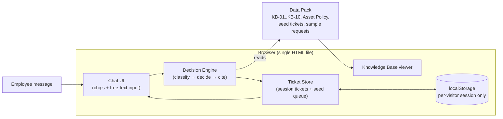
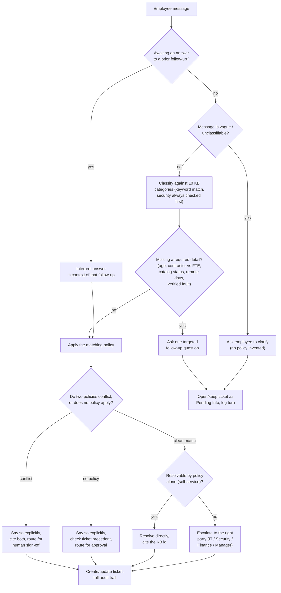

# Architecture & Process Flow — Veridian IT Service Desk Agent

## 1. System architecture

The prototype is intentionally a single self-contained client-side app: no backend,
no database, no API keys to configure. Everything an evaluator needs is inlined into
one HTML file, so it runs from a double-click or a static link with zero setup.

**Why no backend / no LLM API for this build:** the reviewer needs to open a link and
try it immediately, with no server to host and no API key to supply. A rule-based
engine grounded strictly in the data pack also makes every decision *reproducible and
auditable* — the same input always produces the same policy citation, which matters
for something with escalation/compliance stakes. Section 4 below (and
`AI_TOOLS_USED.md`) describes where an LLM layer would sit in a production version.

## 2. Process flow (per message)

## 3. Escalation routing

| Situation | Routed to |
|---|---|
| 5+ failed logins | IT (manual unlock) |
| Contractor needing VPN | Manager (approval form) |
| Non-catalog software | IT Security (3–5 business days) |
| Laptop failure inside the 4-yr asset cycle | IT (verify fault) **+** Finance (sign-off) |
| WFH equipment, >3 days/week | Manager (sign-off) → Finance (processing) → IT (shipping only) |
| Mailbox over quota, needs >25GB | Manager (approval, capped 50GB) |
| Suspected phishing/malware | Security (immediate, no ticket delay) |
| Admin/privileged server access | System owner (no self-service policy exists — precedent: TK-1050 rejected) |
| Expense tool — no account yet | Finance |
| Expense tool — existing account, login error | IT |

## 4. Where this would gain an LLM layer in production

The keyword classifier is deliberately conservative and auditable, but it's brittle
against phrasing the data pack didn't anticipate. A production version would keep the
**same decision engine and policy rules as the source of truth**, and add an LLM
(Claude, via the Anthropic API) at two points only:
1. **Intent understanding** — replace/augment keyword classification with an LLM call
   constrained to return one of the 10 KB ids (or "none"), so odd phrasing still
   routes correctly, while the actual policy logic stays deterministic.
2. **Response phrasing** — have the LLM turn the engine's structured decision
   (category, citation, escalation target) into natural language, instead of the
   fixed templates used here.
Both keep the LLM out of the *decision* itself, which is the part that needs to be
consistent, citable, and safe to audit.
